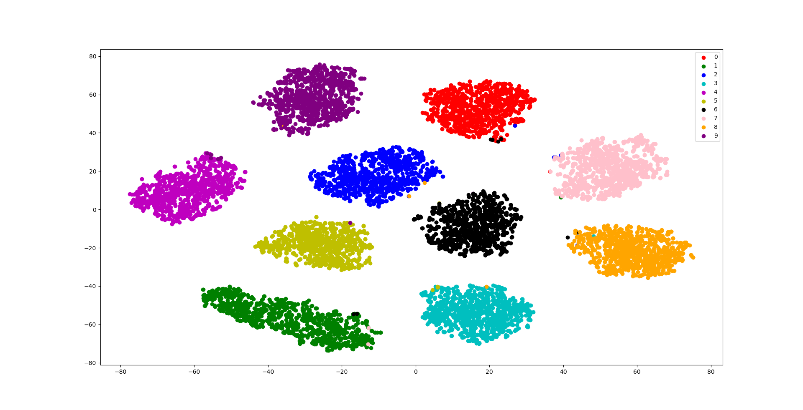

# Keras Triplet Loss

## Over view

- Keras版のTriplet Loss
- [Triplet Loss and Online Triplet Mining in TensorFlow](https://omoindrot.github.io/triplet-loss)がベース
- 2/23時点ではBatch All手法のみ実装済

## DEMO

MNISTで行うと以下のような結果となる.

## Require

### Enviroments

- Windows 10
- Python 3.7.3

### Library

- Keras 2.3.1
- Tensorflow-gpu 2.0.0
  - cpuでは試してないので動作保証しません
  - gpuを使用する場合はCUDA, cuDNNが追加で必要です
- scikit-learn
- matplotlib
